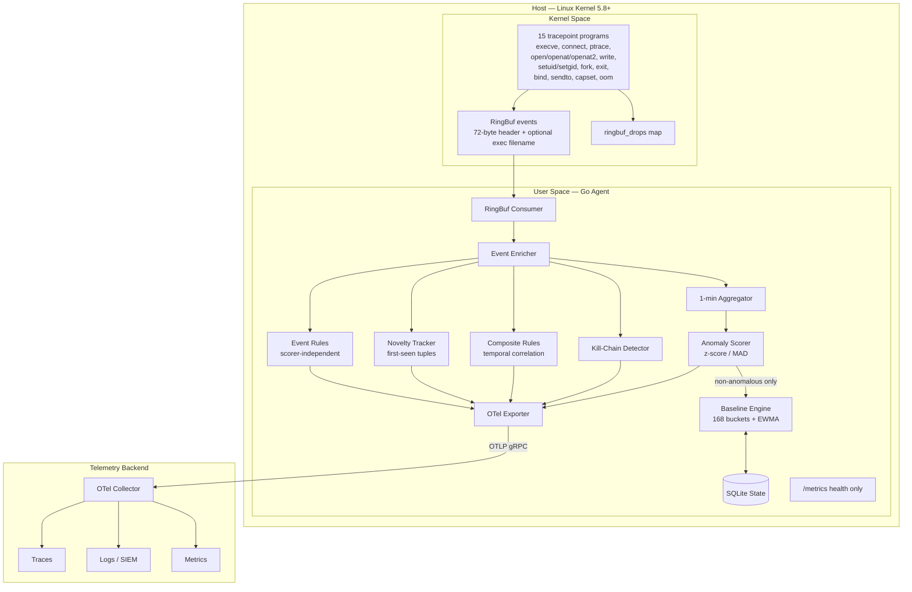
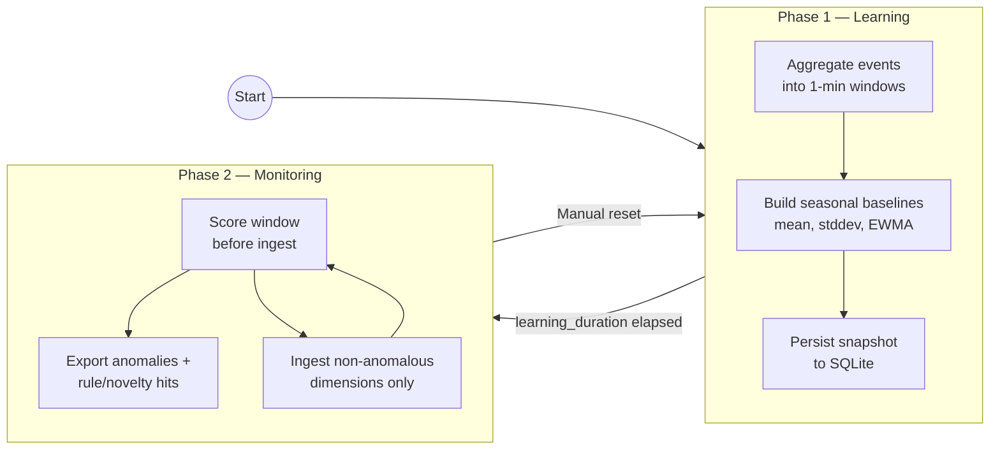

# Design Document

Public design reference for the **eBPF Adaptive Security Agent**. This document describes
how the system works, what is implemented today, and what is planned next.

For a quick start and operator guide, see [README.md](README.md). For configuration
templates, see [host/ebpf-agent/config.yaml](host/ebpf-agent/config.yaml).

---

## Overview

The agent is a two-phase, host-adapting security monitor. It attaches eBPF programs to
kernel tracepoints, learns what “normal” looks like for each host through statistical
analysis, and flags deviations from that learned baseline.

Detection runs **inside the agent**. Results export via **OpenTelemetry** (push) —
anomaly spans, structured security logs, and metrics over OTLP. A minimal Prometheus
`/metrics` endpoint covers agent health only.

**Requirements:** Linux 5.8+ (BPF ringbuf), Go 1.24+, root/CAP_BPF to attach tracepoints.

---

## High-Level Architecture



---

## Two-Phase Lifecycle



| Setting | Default | Purpose |
|---|---|---|
| `baseline.learning_duration` | `168h` (7 days) | Phase 1 duration; captures weekday/weekend patterns |
| `baseline.aggregation_window` | `1m` | Window size for aggregation and scoring |
| `scoring.minimum_samples` | `15` | Samples before a seasonal bucket is “ready” |
| `baseline.new_dimension_learn_window` | `24h` | Fast-track ingest for cold-start dimensions |

During **learning**, high-value security events (ptrace, capset, suspicious connect,
sensitive files) still export via OTel — the audit trail is never paused.

During **monitoring**, each window is scored **before** ingest. Anomalous dimension keys
are excluded from baseline updates so bursts cannot poison statistics.

---

## Detection Pipeline

The agent uses **multiple complementary detection tracks**:

| Track | Package | Trigger | Independent of z-score? |
|---|---|---|---|
| **Statistical anomalies** | `internal/scorer` | Z-score / MAD above threshold | — |
| **Event rules** | `internal/rules` | Config matchers (type + flags) | Yes |
| **Novelty** | `internal/novelty` | First-seen `(process, dest_ip, port)` post-learning | Yes |
| **Composite rules** | `internal/composite` | Ordered steps within time window (e.g. exec → connect) | Yes |
| **Kill-chain** | `internal/mitre/chain.go` | Process lineage + temporal ordering | Yes |

### Event rules (`detection.event_rules`)

Config-driven matchers fire on enriched events regardless of baseline state. Default rules
cover ptrace, capset, suspicious connect, sensitive file access, setuid/setgid, and sudo.

### Novelty tracker

SQLite-backed `novelty_seen` table records first post-learning sightings of outbound
`(process, dest_ip, port)` tuples. Catches low-rate C2/beacon behavior that per-minute
rate baselines miss. Optional beacon-periodicity check for regular inter-connection intervals.

### Composite rules (`detection.composite_rules`)

Explainable multi-step correlation per process. Default: shell exec followed by outbound
connect within 30 seconds.

### Kill-chain detector

Built on a reuse-safe process table (`internal/proctable`) keyed by `(pid, start_ns)`.
Walks real parent lineage, requires temporal ordering (exec before connect), excludes
configurable supervisor roots (systemd, dockerd, containerd, kubelet, runc), and derives
MITRE techniques from actual observed steps. Emits `mitre.kill_chain` OTel spans.

---

## Monitoring Dimensions

Eight orthogonal dimensions, each with its own seasonal baseline profile:

| Dimension | Examples | Baseline granularity |
|---|---|---|
| Process activity | exec rate, fork rate, short-lived processes | per-host, per-user, per-hour |
| Network | connect rate, unique dest IPs, DNS, bind | per-host, per-user, per-hour |
| Per-user | uid-scoped syscall rates | per-uid, per-hour |
| Per-process | comm syscall fingerprint | per-comm, per-day |
| Container | cgroup-scoped rates (optional) | per-cgroup, per-hour |
| File system | sensitive file access, tmp creation, write rate | per-host, per-hour |
| Privilege / auth | sudo, setuid, capset | per-host, per-user |
| Scheduling | OOM kills, fork-bomb score | per-host, per-minute |

### Metric catalog

| Metric | Source | Status |
|---|---|---|
| `exec_rate`, `fork_rate`, `short_lived_process` | execve, fork, exit | Implemented |
| `connect_rate`, `unique_dest_ips`, `dns_query_rate`, `listening_port_count` | connect, sendto, bind | Implemented |
| `bytes_tx` / `bytes_rx` | cgroup/net byte counters | **Planned** |
| `sensitive_file_access_rate`, `tmp_file_creation_rate`, `file_write_rate` | open/openat/openat2, write | Implemented |
| `sudo_rate`, `setuid_rate`, `capability_change_rate` | execve, setuid, capset | Implemented |
| `oom_kill`, `fork_bomb_score` | oom/mark_victim, fork | Implemented |

Dimension keys support optional **deploy-churn normalization** (`dimensions.normalize_binary_version`,
`dimensions.prefer_image_name`) to reduce false cold-starts after binary upgrades or
container restarts.

---

## eBPF Layer

### Event structure (72-byte header)

```c
struct ebpf_event {
    __u64 timestamp_ns;
    __u32 pid;
    __u32 ppid;             /* from pid_parents map */
    __u32 uid;
    __u8  event_type;
    __u8  flags;
    __u16 dest_port;
    __u8  ip_version;       /* 4=IPv4, 6=IPv6 */
    __u8  path_len;         /* open events: path tail length */
    __u16 _pad;
    __u64 cgroup_id;
    __u8  dest_ip[16];
    char  comm[16];
    __u32 _tail_pad;
};
```

Exec events append up to 128 bytes of filename via `bpf_ringbuf_output`. Open events emit
bounded paths to userspace for sensitive-file matching.

### Tracepoints (15)

| Tracepoint | Purpose |
|---|---|
| `sys_enter_execve` | Execution, sudo detection |
| `sys_enter_connect` | Outbound connections, C2 port flags |
| `sys_enter_ptrace` | Process injection |
| `sys_enter_openat` / `open` / `openat2` | File access (paths to userspace) |
| `sys_enter_write` | Write rate (kernel rate-limited) |
| `sys_enter_setuid` / `setgid` | Privilege escalation |
| `sys_enter_capset` | Capability changes |
| `sched_process_fork` / `exit` | Lifecycle, fork-bomb, short-lived |
| `sys_enter_bind` | New listening ports |
| `sys_enter_sendto` | DNS (port 53 filter) |
| `oom/mark_victim` | OOM kills |

Compile-time flags (`MONITOR_*` in the Makefile) gate individual programs.

### Enricher

- **Exec:** binary path from in-kernel filename tail (no TOCTOU).
- **Other events:** PID → binary via TTL LRU cache (`/proc/<pid>/exe`).
- **UID → username:** periodic `/etc/passwd` refresh.
- **cgroup → container label:** cgroup path resolution.
- **Sensitive files:** userspace inode/path match (`internal/sensitive`) against
  `detection.sensitive_paths` (shadow, sudoers, authorized_keys).

---

## Baseline Engine

### Seasonal model — 168 hourly buckets

Behavior is seasonal: build servers spike weekdays, cron fires at night, backups run
Sundays. The engine maintains separate statistics for each **(hour-of-day, day-of-week)**
pair (24 × 7 = 168 buckets).

### Two-timescale EWMA

| Component | Alpha | Role |
|---|---|---|
| Slow EWMA | `0.01` (default) | Variance baseline; intentional slow drift adaptation |
| Fast trend | `fast_trend_alpha` (default `0.1`) | Organic growth trend; scorer detrends observations |

### Scoring enhancements

- **Z-score** with `min_stddev` floor (default `1.0`) — prevents `+Inf` on constant dimensions.
- **MAD** auto-selected when \|skewness\| > 1.0 on a 32-sample observation ring (or forced via `mad_enabled`).
- **Confidence-weighted severity** — thin-bucket and cold-start anomalies downgraded to `info`; never `critical` on low-confidence buckets.
- **Ceilings** — absolute per-metric caps (`scoring.ceilings`) as `warning` backstops; optional baseline-relative caps via `ceiling_multiplier`.
- **Maintenance windows** — `scoring.maintenance_windows` suppress scoring during known batch periods.
- **Neighbor-bucket fallback** — sparse seasonal slots borrow ready neighbors instead of staying silent forever.
- **Fast-track hold** — high-severity new dimensions (`fast_track_hold_high_severity`) are not auto-normalized during the 24h fast-track window.

### Cold-start policy

Dimensions first seen after learning complete trigger cold-start alerts (severity downgraded
to `info` at runtime). They enter a 24h fast-track where windows ingest but repeat alerts
are suppressed until the window elapses.

---

## Telemetry Export

### Why OTel-primary

Security agents should **push** enriched results outbound. Prometheus scrape loses
per-event context, requires inbound reachability, and encourages duplicating detection
logic in PromQL. The agent exports finished intelligence (spans, logs, metrics) via OTLP.

### Signal types

| Signal | Source | Content |
|---|---|---|
| **Traces** | Anomaly scorer, kill-chain | Anomaly spans with z-score, dimension, MITRE; `mitre.kill_chain` spans |
| **Logs** | Event rules, novelty, high-value events | Structured security LogRecords for SIEM |
| **Metrics** | MeterProvider registered | Baseline/anomaly OTLP instruments **planned** |

### Flag-aware sampling

High-value events export at 100% by default (`ptrace`, `suspicious_connect`, `sudo`,
`sensitive_file`, `capset`, `setuid`). Routine traffic (`connect`, `exec`, `dns`) samples
at configurable low rates to control cardinality.

### Prometheus — health only

| Metric | Description |
|---|---|
| `ebpf_agent_info` | Version, host labels |
| `ebpf_baseline_phase` | 1=learning, 2=monitoring |
| `ebpf_baseline_progress` | Learning progress 0.0–1.0 |
| `ebpf_events_processed_total` | Throughput |
| `ebpf_ringbuf_drops_total` | Userspace backpressure drops |
| `ebpf_ringbuf_bpf_drops_total` | Kernel reserve failures |
| `ebpf_enrichment_failures_total` | PID/binary resolution failures |
| `ebpf_dimensions_not_ready` | Buckets below `minimum_samples` |
| `ebpf_tracepoints_attached` | Active BPF attachments |

---

## MITRE ATT&CK Mapping

Context-aware resolution in `internal/mitre/mitre.go` uses binary path, `comm`, flags,
and destination port/IP — not just raw event type.

| Context | Technique |
|---|---|
| `comm=bash` / `sh` / `zsh` | T1059.004 Unix Shell |
| `comm=python3` | T1059.006 Python |
| `comm` in cron/crond/anacron/atd | T1053.003 Cron |
| binary basename ≠ `comm` | T1036.003 Masquerade |
| sudo flag on exec | T1548.003 Sudo |
| connect port 80/443 | T1071.001 Web Protocols |
| connect to C2 port (config map) | T1571 Non-Standard Port |
| sensitive file open | T1003.008 Credential files |
| ptrace | T1055 Process Injection |
| bind privileged port | T1205 Traffic Signaling |
| DNS (port 53) | T1071.004 DNS |

Fork/exit events carry no technique tags (volume noise).

---

## Deployment

### Single host

```
Agent ──OTLP gRPC──► OTel Collector ──► Traces / Logs / Metrics backends
Agent ◄──scrape──── Prometheus (health metrics only)
```

### Multi-host fleet

Each agent pushes independently to an OTel Gateway or load-balanced collector. No inbound
ports required on monitored hosts — critical for firewalled and ephemeral workloads.

Example collector config: [host/ebpf-agent/examples/otel-collector/](host/ebpf-agent/examples/otel-collector/).

---

## Configuration Reference

See [host/ebpf-agent/config.yaml](host/ebpf-agent/config.yaml) for the full template.
Key sections:

```yaml
baseline:
  learning_duration: 168h
  aggregation_window: 1m
  ewma_alpha: 0.01
  fast_trend_alpha: 0.1
  new_dimension_learn_window: 24h
  fast_track_hold_high_severity: true

scoring:
  zscore_threshold: 3.0
  minimum_samples: 15
  mad_enabled: false
  ceiling_multiplier: 3.0
  maintenance_windows: []

detection:
  suspicious_ports: [4444, 1337, 5555, 6666, 8443, 1234, 31337]
  sensitive_paths: ["/etc/shadow", "/etc/sudoers", "/root/.ssh/authorized_keys"]
  supervisor_roots: [systemd, dockerd, containerd, kubelet, runc]
  event_rules: []      # sensible defaults when empty
  composite_rules: []  # sensible defaults when empty

dimensions:
  per_user: true
  per_process: true
  per_container: false
  normalize_binary_version: true
  prefer_image_name: true

otel:
  enabled: false
  endpoint: "127.0.0.1:4317"
  protocol: grpc
  export_traces: true
  export_logs: true
  export_metrics: true
  sampling: { ptrace: 1.0, suspicious_connect: 1.0, connect: 0.01, exec: 0.01, ... }
  batch: { max_queue_size: 8192, max_export_batch: 512, export_timeout: 30s }
```

---

## Implementation Status

| Component | Status |
|---|---|
| 15 BPF tracepoints + ringbuf + drop counter | Done |
| Event enricher (exec in-kernel path, LRU PID cache, cgroup) | Done |
| 168-bucket seasonal baseline + two-timescale EWMA | Done |
| Z-score / MAD scorer + confidence severity + ceilings | Done |
| Event rules, novelty, composite, kill-chain tracks | Done |
| Userspace sensitive-file inode matching | Done |
| Deploy-churn dimension normalization | Done |
| Context-aware MITRE mapper + kill-chain spans | Done |
| OTel exporter (traces, logs, batch config) | Done |
| SQLite persistence + phase management | Done |
| Integration replay harness + BPF layout parity tests | Done |
| OTLP baseline/health metric instruments | Planned |
| `otel.headers` wired to gRPC dial | Planned |
| Full `BPF_PROG_TEST_RUN` BPF harness | Planned |
| `bytes_tx` / `bytes_rx` metrics | Planned |

---

## Roadmap — Planned Features

### Near term

| Feature | Notes |
|---|---|
| **`bytes_tx` / `bytes_rx`** | Per-container network byte counters; needs cgroup/net stack attachment |
| **OTLP metric instruments** | Baseline mean/stddev gauges, anomaly counters via MeterProvider |
| **`otel.headers`** | Wire reserved config field to gRPC dial options |
| **Full argv capture** | Beyond 16-char `comm` truncation |
| **LD_PRELOAD detection** | Environment/loader heuristics at exec |
| **DNS tunneling heuristics** | Query entropy, subdomain length, unusual record types |
| **Structured log format flag** | JSON/logfmt toggle for stderr/journald output |
| **`/metrics` hardening** | TLS, auth alignment with server config |
| **`BPF_PROG_TEST_RUN` harness** | Deterministic per-program BPF unit tests |

### Future research

| Topic | Notes |
|---|---|
| **ML second-layer scoring** | Autoencoder / isolation forest over per-window feature vectors for joint anomalies; needs labeled data and training pipeline |
| **Longer-horizon baselines** | 168-bucket model captures weekly cycles only; monthly batch jobs may need extended horizons or explicit maintenance windows |
| **Low-and-slow evasion** | Rate detection cannot catch adversaries below per-minute thresholds indefinitely; novelty + rule/composite tracks are the primary mitigations |
| **Cross-host correlation** | Fleet-wide attack-chain correlation via OTel Gateway (deployment pattern documented; not built into the agent) |

---

## Key Design Decisions

1. **Agent-side detection, OTel-exported results** — Scoring internals stay in compiled Go; downstream sees enriched spans/logs, not algorithms.
2. **RingBuf over per-CPU hash maps** — Variable-length events, backpressure via drops, single consumer.
3. **SQLite for persistence** — Atomic writes, queryable baselines, survives restarts without re-learning.
4. **Minimum 7-day learning** — Captures full weekly seasonality; phase transition is time-based.
5. **Score before ingest** — Anomalous windows never poison baselines.
6. **Per-event OTel logs** — SIEMs need per-event audit trails; aggregation runs in parallel for baselining.
7. **Prometheus for health only** — Detection output flows exclusively through OTel.

---

## Security Considerations

- **Ringbuf backpressure** — Events drop under load rather than growing unbounded.
- **State file permissions** — `baseline.db` must be root-owned (`0600`); writable by others enables baseline poisoning.
- **EWMA drift** — Gradual escalation can shift baselines over weeks; mitigated by ceiling thresholds, anomalous-window ingest gating, and novelty/rule tracks.
- **Learning phase** — No statistical alerts during Phase 1; high-value event logs still export.
- **OTel collector trust** — Use TLS and authentication in production (`otel.insecure: false`).
- **Enricher TOCTOU** — Exec path is kernel-sourced; other events may miss very short-lived processes. Sensitive-file matching resolves paths in userspace after open (residual TOCTOU).
- **Deploy-churn normalization** — Version-stripping may false-merge distinct binaries on shared hosts; toggle per environment.

---

## Testing

```bash
cd host/ebpf-agent
make bpf          # compile BPF (needs clang + kernel headers)
make test         # go test ./...
go test -tags=integration ./internal/integration/...   # pipeline replay harness
```

| Layer | Coverage |
|---|---|
| Go unit tests | baseline, scorer, phase, config, aggregator, mitre, otelexport, composite |
| Integration replay | cold-start, z-score burst, ceiling skip, sampling parity |
| BPF layout parity | `internal/ringbuf/layout_test.go` |
| Live host | Requires root; eBPF attachment and real syscall validation |

---

## Dependencies

| Component | Purpose |
|---|---|
| `github.com/cilium/ebpf` | BPF loading, maps, ringbuf |
| `go.opentelemetry.io/otel/*` | Traces, logs, metrics export |
| `prometheus/client_golang` | Health metrics endpoint |
| `modernc.org/sqlite` | Baseline persistence (pure Go) |
| `go.yaml.in/yaml/v2` | Configuration |

Estimated OTel binary overhead: ~6–8 MB (gRPC shared across exporters). All pure Go, no CGO.

---

## Repository Layout

```
host/ebpf-agent/
├── cmd/agent/main.go          # Entry point; wires all components
├── bpf/exec.bpf.c             # All eBPF kernel programs
├── internal/
│   ├── ringbuf/               # BPF ringbuf consumer
│   ├── enricher/              # PID/UID/cgroup enrichment
│   ├── aggregator/            # 1-minute time-window bucketing
│   ├── baseline/              # Seasonal model + EWMA
│   ├── scorer/                # Z-score / MAD anomaly detection
│   ├── rules/                 # Config-driven event rules
│   ├── novelty/               # First-seen tuple tracking
│   ├── composite/             # Multi-step correlation rules
│   ├── proctable/             # Reuse-safe process table
│   ├── mitre/                 # ATT&CK mapping + kill-chain
│   ├── phase/                 # Learning ↔ monitoring state machine
│   ├── otelexport/            # OpenTelemetry OTLP export
│   ├── sensitive/             # Inode/path sensitive-file matching
│   ├── dimkey/                # Dimension key normalization
│   └── store/                 # SQLite persistence
├── config.yaml                # Full configuration template
└── examples/otel-collector/   # Sample collector pipeline
```

---

*Last updated: 2026-06-13 — reflects Detection FP/FN Hardening and P0–P7 implementation.*
