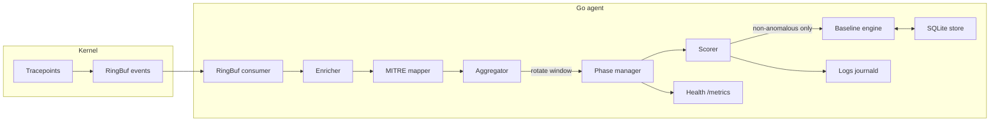

# eBPF Adaptive Security Agent

[](https://opensource.org/licenses/MIT)
[](https://golang.org/)
[](https://www.kernel.org/)
[](https://ebpf.io/)

A host-adapting security monitoring agent that uses eBPF to learn normal system behavior and detect anomalies. The agent operates in two phases: it first establishes per-host baselines through statistical analysis, then monitors for deviations using z-score anomaly detection with context-aware MITRE ATT&CK mapping.

## How It Works

The agent attaches eBPF programs to kernel tracepoints to observe syscalls at the kernel level. Events flow through a structured pipeline:

1. **Kernel**: Tracepoint programs capture syscall metadata (pid, ppid, uid, cgroup, process name) and push structured events to a ringbuf (72-byte header; exec events append filename tail).
2. **Enrichment**: The Go agent drains the ringbuf. Exec events use the in-kernel filename (no TOCTOU). Other events resolve PIDs via TTL LRU cache, UIDs via refreshed `/etc/passwd`, cgroup paths to container IDs.
3. **MITRE Mapping**: Each enriched event is mapped to MITRE ATT&CK techniques. `ChainDetector` correlates `ppid` lineage for kill-chain spans (exec→connect patterns).
4. **Aggregation**: Events are bucketed into 1-minute windows per dimension (user, process, container, metric type).
5. **Baselining**: A 168-bucket seasonal model (24 hours x 7 days) tracks per-dimension EWMA mean and variance per hour-of-week. Neighbor buckets are used when a seasonal slot lacks enough samples.
6. **Scoring**: In monitoring, each window is scored **before** ingest. Anomalous dimensions are not folded into the baseline. Z-score (or MAD when skewness warrants) uses EWMA-blended stats with a minimum stddev floor. New dimensions enter a 24h fast-track before full cold-start alerting.

### Two-Phase Operation

**Phase 1 — Learning** (default: 7 days): The agent collects events and builds per-dimension, per-time-of-day baselines. High-value security events (ptrace, capset, suspicious connections) are still logged during this phase.

**Phase 2 — Monitoring**: Each aggregation window is scored against EWMA-blended baselines; anomalous dimension keys are excluded from ingest. Anomalies go to **OpenTelemetry** (when `otel.enabled`) and **journald**. High-value events export as OTLP **LogRecords** (and optional spans). Kill-chain patterns emit `mitre.kill_chain` spans. MITRE technique IDs attach to enriched events.

## MITRE ATT&CK Coverage

The agent maps kernel events to MITRE techniques using enrichment context, not just event type. A single event can produce multiple technique attributions.

| Technique | Name | Detection | Context-Aware |
|---|---|---|---|
| T1059.004 | Unix Shell | `execve` + comm=bash/sh/zsh | Binary path match |
| T1059.006 | Python | `execve` + comm=python3 | Binary path match |
| T1053.003 | Cron | `execve` + comm in cron/crond/anacron/atd | Process `comm` match |
| T1036.003 | Rename System Utilities | `execve` + binary basename != comm | Name mismatch detection |
| T1548.003 | Sudo and Sudo Caching | `execve` + sudo flag | BPF flag detection |
| T1548.001 | Setuid and Setgid | `setuid()`/`setgid()`/`capset()` | Direct syscall |
| T1003.008 | /etc/shadow and sudoers | `openat()` / `open()` / `openat2()` on sensitive files | Userspace inode/path match (`internal/sensitive`) |
| T1055 | Process Injection | `ptrace()` | Direct syscall |
| T1071.001 | Web Protocols | `connect()` to port 80/443 | Port-based classification |
| T1571 | Non-Standard Port | `connect()` to C2 ports | BPF flag detection |
| T1021.004 | SSH | `connect()` to port 22 | Port-based classification |
| T1021 | Remote Services | `connect()` to RFC1918 ranges | IP range detection |
| T1205 | Traffic Signaling | `bind()` on privileged port (<1024) | Port range check |
| T1046 | Network Service Discovery | `bind()` on unprivileged port | Port range check |
| T1071.004 | DNS | `sendto()` to port 53 | Port filter in BPF |

## What It Monitors

| Dimension | Tracepoints | Baseline Granularity |
|---|---|---|
| **Process Activity** | `sys_enter_execve`, `sched_process_fork`, `sched_process_exit` | per-host, per-user, per-hour |
| **Network** | `sys_enter_connect`, `sys_enter_bind`, `sys_enter_sendto` (DNS) | per-host, per-user, per-hour |
| **Privilege Escalation** | `sys_enter_setuid`, `sys_enter_setgid`, `sys_enter_capset` | per-host, per-user |
| **Sensitive Files** | `sys_enter_openat`, `sys_enter_open`, `sys_enter_openat2` | per-host, per-hour |
| **File Writes** | `sys_enter_write` (rate-limited) | per-host, per-hour |
| **OOM / Scheduling** | `oom/mark_victim`, fork-bomb via `sched_process_fork` | per-host |
| **Process Injection** | `sys_enter_ptrace` | per-host |
| **Per-User Profiling** | All above, keyed by UID | per-uid, per-hour |
| **Per-Process Profiling** | All above, keyed by comm | per-comm, per-day |
| **Container** | All above, keyed by cgroup ID | per-cgroup, per-hour |

## Prerequisites

- Linux kernel 5.8+ with eBPF support
- Go 1.24+
- clang and llvm
- libbpf development headers (`libbpf-dev` on Debian/Ubuntu, `libbpf-devel` on RHEL/Fedora, `libbpf` on Arch)
- Kernel headers installed

## Quick Start

From the repo root you can use `scripts/quick-start.sh` (installs build deps on Debian/Ubuntu, Arch, or RHEL-family, then builds and optionally installs the systemd unit), or build manually:

```bash
cd host/ebpf-agent

# Build eBPF programs and Go binary (requires clang, libbpf headers, kernel headers)
make all

# Run (requires root; reads ./config.yaml in the current directory)
sudo ./ebpf-agent

# Or install as a systemd service (uses /etc/ebpf-agent/config.yaml)
sudo make install
```

The agent exposes a health endpoint on `http://localhost:9110/metrics` (operational metrics only — not anomaly scores). Anomalies and `ENRICH-FAIL` lines go to **stderr/journald**; when **`otel.enabled: true`**, detection output is also sent via **OTLP** (see `host/ebpf-agent/config.yaml`).

## Configuration

The agent reads `config.yaml` from the working directory (or pass `-config /path/to/config.yaml`). **At least one `tracepoints` entry is required** — copy the full `tracepoints:` list from `host/ebpf-agent/config.yaml` in the repo; the snippet below shows only the adaptive-baseline knobs (add `otel:` when using a collector).

```yaml
server:
  port: 9110
  metrics_path: /metrics

host:
  id: ""  # auto-detected from /etc/machine-id

baseline:
  learning_duration: 168h      # 7 days
  aggregation_window: 1m
  recalibration_interval: 24h
  ewma_alpha: 0.01
  min_stddev: 1.0              # floor to prevent +Inf z-scores
  state_file: /var/lib/ebpf-agent/baseline.db

scoring:
  zscore_threshold: 3.0
  minimum_samples: 15
  cold_start_severity: warning # severity for new dimensions post-learning

detection:
  suspicious_ports: [4444, 1337, 5555, 6666, 8443, 1234, 31337]

dimensions:
  per_user: true
  per_process: true
  per_container: false
  network: true
  filesystem: true
  scheduling: true

# Required: list every tracepoint to attach (see config.yaml in repo for full list)
tracepoints:
  - group: syscalls
    name: sys_enter_execve
    program: trace_exec
  # ... add remaining programs from host/ebpf-agent/config.yaml
```

### Feature Flags

Disable detection modules at compile time:

```bash
make bpf MONITOR_CONNECT=0 MONITOR_PTRACE=0 MONITOR_DNS=0
```

Available flags: `MONITOR_EXEC`, `MONITOR_SUDO`, `MONITOR_CONNECT`, `MONITOR_PTRACE`, `MONITOR_OPENAT`, `MONITOR_OPEN`, `MONITOR_OPENAT2`, `MONITOR_WRITE`, `MONITOR_SETUID`, `MONITOR_FORK`, `MONITOR_EXIT`, `MONITOR_BIND`, `MONITOR_DNS`, `MONITOR_CAPSET`, `MONITOR_OOM`. (`MONITOR_PASSWD` is deprecated — no BPF code path; sensitive matching is userspace.)

## Health Metrics

The `/metrics` endpoint exposes agent operational health, not security detection output.

| Metric | Type | Description |
|---|---|---|
| `ebpf_agent_info` | Gauge | Agent metadata: host, version |
| `ebpf_baseline_phase` | Gauge | 1=learning, 2=monitoring |
| `ebpf_baseline_progress` | Gauge | 0.0-1.0 during learning |
| `ebpf_events_processed_total` | Counter | Total events through the pipeline |
| `ebpf_ringbuf_drops_total` | Counter | Userspace channel-full drops |
| `ebpf_ringbuf_bpf_drops_total` | Counter | Kernel `bpf_ringbuf_reserve` failures |
| `ebpf_dimensions_not_ready` | Gauge | Dimensions below `minimum_samples` in current seasonal bucket |
| `ebpf_enrichment_failures_total` | Counter | PID/binary resolution failures |
| `ebpf_otel_export_errors_total` | Counter | OTel provider shutdown failures (incremented on `Shutdown` error) |
| `ebpf_tracepoints_attached` | Gauge | Number of active tracepoints |

## OpenTelemetry

Set **`otel.enabled: true`** and point **`otel.endpoint`** at an OpenTelemetry Collector (**OTLP gRPC only**; default port **4317**). The agent ships **`internal/otelexport`**: anomaly spans, security **LogRecords** (primary SIEM path), optional security spans, kill-chain spans, and OTLP metric/log providers. **`otel.batch`** configures trace/log batch processors. See **`examples/otel-collector/otel-collector-config.yaml`** (filter, tail_sampling, attributes, batch, routing connector).

The default **`otel.insecure: true`** is for local collectors. For remote endpoints, set **`insecure: false`** and configure TLS/credentials appropriate to your environment.

When OTel is disabled, detection output remains on **journald** / process logs; **`/metrics`** stays health-only.

## Architecture

Additional Mermaid diagrams (system context, pipeline, phases, telemetry): see **[diagram.md](diagram.md)** in the repo root.

Data flows from kernel tracepoints through a ringbuf into userspace enrichment, MITRE tagging, time-window aggregation, and seasonal baselining. In the monitoring phase, anomalies are **logged** and optionally exported via **OTLP**; `/metrics` exposes **agent health only** (not z-scores as Prometheus series).



```
host/ebpf-agent/
├── bpf/
│   ├── exec.bpf.c              # eBPF programs (all tracepoints + ringbuf)
│   └── vmlinux.h                 # Kernel type definitions (libbpf headers from system)
├── cmd/agent/
│   ├── main.go                 # Entry point, wires all components
│   └── bpf/exec.bpf.o          # Embedded BPF object (generated by make bpf)
├── internal/
│   ├── config/                  # YAML config parsing + validation
│   ├── ringbuf/                 # Ringbuf consumer + event parsing
│   ├── enricher/                # PID/UID/cgroup enrichment (TTL LRU cache)
│   ├── mitre/                   # Context-aware MITRE mapper + kill-chain
│   ├── aggregator/              # Time-window bucketing
│   ├── baseline/                # 168-bucket seasonal model + EWMA scoring
│   ├── scorer/                  # Z-score / MAD anomaly detection + cold-start
│   ├── store/                   # SQLite state persistence (WAL)
│   ├── phase/                   # Learning/monitoring phase management
│   ├── otelexport/              # OTLP gRPC export
│   └── version/                 # Agent version constant
├── examples/prometheus/         # Health-only scrape + alert examples
├── config.yaml
├── Makefile
├── ebpf-agent.service
├── go.mod
└── go.sum
```

## Development

```bash
cd host/ebpf-agent

# Build just the BPF object
make bpf

# Build just the Go binary
make build

# Run tests
make test

# Inspect eBPF maps at runtime (map names depend on your BPF build)
sudo bpftool map list
```

### Prometheus

The agent does **not** export per-event counters or anomaly gauges to Prometheus — only **health** metrics (phase, progress, events processed, userspace/kernel ringbuf drops, dimensions not ready, enrichment failures, OTel export errors, tracepoints attached). Use `examples/prometheus/scrape.yml` and `examples/prometheus/alerts.yml` for availability alerting. For detection output, use **OpenTelemetry** (`otel.enabled`) and/or **journald** logs.

## Detection Limitations

- **Packet payload inspection** — sees destination port/IP but not data content
- **Fileless malware** — `memfd_create` + `execveat` bypasses the `execve` tracepoint
- **Path matching** — BPF emits bounded open paths; sensitive-file detection resolves symlinks/inodes in userspace (`internal/sensitive`). Residual TOCTOU: path is resolved after the open syscall. Exec events carry up to 128 bytes of filename from kernel.
- **Failed syscalls** — `sys_enter_*` tracepoints fire before the kernel returns; EPERM/refused operations look the same as successes
- **Cross-host correlation** — each agent is independent; fleet correlation via OTel Gateway is planned
- **Kernel rootkits** — malicious kernel modules can hide events from eBPF
- **DNS tunneling** — counts DNS queries but does not inspect query content
- **LD_PRELOAD injection** — shared library hijacking does not trigger `ptrace()` or `execve()`
- **Network bytes** — `bytes_tx/rx` metrics not yet implemented (no cgroup byte counters attached)

## Security Considerations

- Requires root privileges for tracepoint attachment
- Baseline state file (`/var/lib/ebpf-agent/baseline.db`) must be root-owned (0600) to prevent baseline poisoning
- EWMA drift adaptation means an attacker slowly escalating over weeks could shift the baseline — mitigated by anomalous-window ingest gating and absolute ceiling thresholds (`scoring.ceilings`)
- During the learning phase, high-value security events (ptrace, capset, suspicious connections) are still logged
- Exec events carry the filename in-kernel (no `/proc` round-trip); other events may still hit enricher TOCTOU for short-lived processes — logged as `ENRICH-FAIL`
- Enable TLS and basic auth on the health endpoint in production

## Changelog (2026-06-13)

Refined Next Implementations (ARCHITECTURE P1–P7):

| Area | Change |
|---|---|
| **P1 Tests** | Integration replay harness; BPF header layout parity tests |
| **P2 Struct** | 72B header + `ppid` + variable-length exec filename; schema v2 snapshots |
| **P2 Fast-track** | `new_dimension_learn_window` wired — cold-start dimensions learn over 24h |
| **P3 Coverage** | `open`/`openat2`/`write`/`oom` tracepoints; fork-bomb, short-lived, tmp/write metrics |
| **P5 OTel** | Security events as LogRecords; batch config wired; hardened collector example |
| **P6 Kill-chain** | Open-source temporal MITRE correlation via `ppid` + OTel spans |
| **P7 Scorer** | 32-sample observation ring; auto MAD when \|skewness\| > 1 |

## Changelog (2026-06-13)

Detection FP/FN Hardening — reduced false positives and false negatives:

| Area | Change |
|---|---|
| **Sensitive files** | Dropped `/etc/passwd` BPF flagging; userspace inode/path match (`internal/sensitive`) for shadow/sudoers/authorized_keys |
| **Scorer** | Confidence-weighted severity; context-relative ceilings; maintenance-window suppression |
| **Dimensions** | Deploy-churn normalization (version-stripped binaries, container image preference) |
| **Rules** | Config-driven event rule track (`detection.event_rules`); composite correlation rules |
| **Novelty** | First-seen `(process, dest_ip, port)` tuples + beacon check (SQLite-backed) |
| **Kill-chain** | Rebuilt on reuse-safe process table; supervisor exclusion; derived MITRE techniques |
| **Baseline** | Two-timescale EWMA (fast trend + slow variance); fast-track hold for high-severity dimensions |

## Changelog (2026-06-12)

Bug Fix Sprint — correctness and detection reliability:

| Area | Change |
|---|---|
| **Phase / scoring** | Score before ingest in monitoring; skip anomalous dimensions from baseline (fixes dead cold-start + poisoning) |
| **BPF** | Fix `/etc/shadow` and `/etc/sudoers` path length checks; IPv6 dest IP via stack `memcpy`; kernel `ringbuf_drops` counter |
| **Baseline** | EWMA mean/variance used for scoring; neighbor-bucket fallback; legacy snapshot backfill on restore |
| **OTel** | Flag-aware sampling (`suspicious_connect`, `sudo`, `sensitive_file` at 100%) |
| **Enricher** | TTL LRU PID cache, periodic `/etc/passwd` refresh, cgroup path → container ID |
| **MITRE** | Fork/exit no longer tagged; sensitive-file open via userspace inode match |
| **Config** | `detection.suspicious_ports` BPF map; `minimum_samples` default 15; validation for durations and basic_auth |
| **Persistence** | SQLite WAL + busy_timeout; state file chmod 0600 on save |
| **Tests** | `phase`, `baseline`, `otelexport`, `mitre` unit tests |

Full internal changelog: `state.md` (local, not in git). Step-by-step guide: `local/HOW_IT_WORKS.md` (local, not in git).

## Contributing

See [CONTRIBUTING.md](CONTRIBUTING.md) for contribution guidelines.

## License

MIT License — see [LICENSE](LICENSE).
