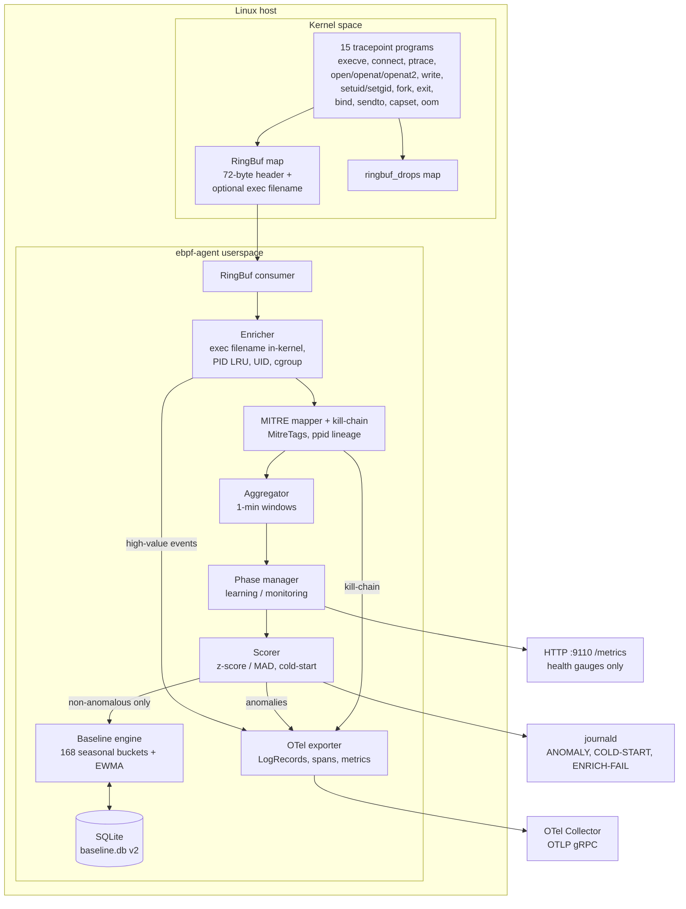
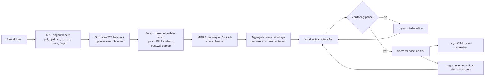
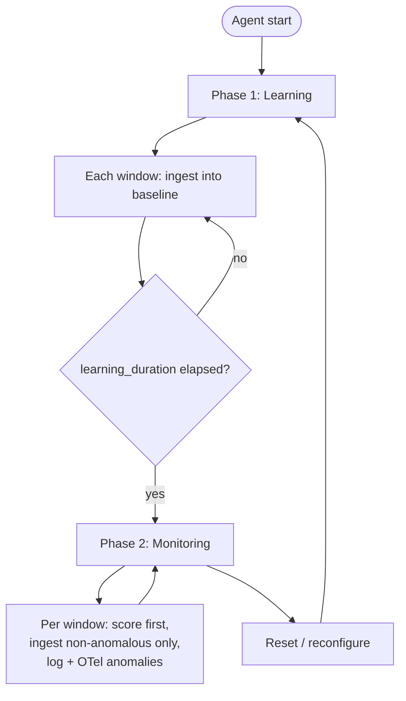
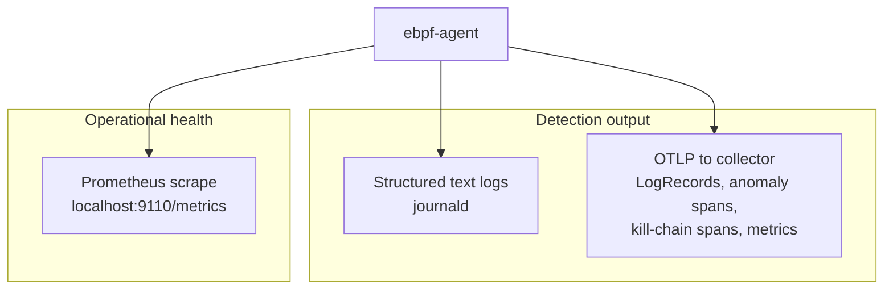
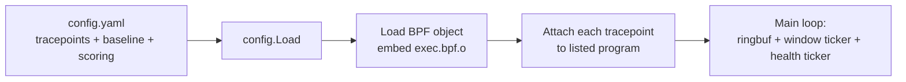

# eBPF Adaptive Agent — Technical Diagrams

Mermaid sources for the host agent (`host/ebpf-agent`). Render in GitHub, GitLab, or any Mermaid-capable viewer.

---

## 1. System context

---

## 2. Event path (detection pipeline)

---

## 3. Two-phase lifecycle

---

## 4. Telemetry split (current implementation)

---

## 5. Config and BPF attachment

